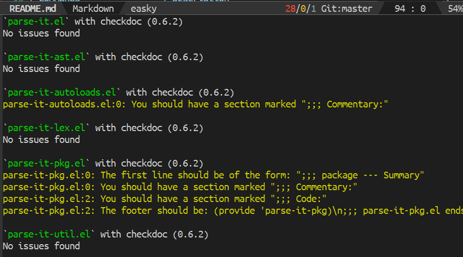
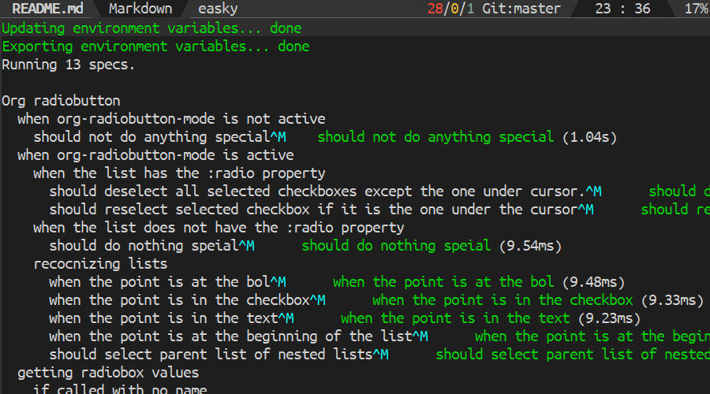

[](https://www.gnu.org/licenses/gpl-3.0)
[](https://jcs-emacs.github.io/jcs-elpa/#/easky)
[](https://melpa.org/#/easky)
[](https://stable.melpa.org/#/easky)
<a href="#"></a>

# easky
> Control Eask CLI in Emacs

[](https://github.com/emacs-eask/easky/actions/workflows/test.yml)

`Easky` is the interface to control [Eask CLI](https://github.com/emacs-eask/cli),
it's a package manager and sandbox tools to test and manage your elisp packages.

<!-- markdown-toc start - Don't edit this section. Run M-x markdown-toc-refresh-toc -->
**Table of Contents**

- [🏆 Features](#🏆-features)
- [💾 Installation](#💾-installation)
  - [🔍 Step 1. Install [Eask CLI](https://github.com/emacs-eask/cli)](#🔍-step-1-install-eask-clihttpsgithubcomemacs-easkcli)
  - [🔍 Step 2. Install `Easky` (this package)](#🔍-step-2-install-easky-this-package)
    - [package.el](#packageel)
    - [use-package](#use-package)
    - [Manual installation](#manual-installation)
- [🔰 Quick start](#🔰-quick-start)
- [📇 Support Commands](#📇-support-commands)
  - [🔈 Create](#🔈-create)
  - [📚 Generate](#📚-generate)
  - [📚 Documentation](#📚-documentation)
  - [💻 Execution](#💻-execution)
  - [🧹 Cleaning](#🧹-cleaning)
  - [📝 Linting](#📝-linting)
  - [🔗 Linking](#🔗-linking)
  - [🔍 Testing](#🔍-testing)
  - [🔗 Control DSL](#🔗-control-dsl)
- [📈 Checker](#📈-checker)
- [🔧 Customization](#🔧-customization)
  - [🧪 Variables](#🧪-variables)
- [🔌 Plugins](#🔌-plugins)
  - [📦 `package` module](#📦-package-module)
- [🌟 Other packages you may be interested](#🌟-other-packages-you-may-be-interested)
- [🛠️ Contribute](#🛠️-contribute)
  - [🔬 Development](#🔬-development)
- [⚜️ License](#⚜️-license)

<!-- markdown-toc end -->

## 🏆 Features

Easky is out of the box and comes along with many features.

| Eask-file Management    | List installed packages                     |
|-------------------------|---------------------------------------------|
|  |  |

| Linting with `checkdoc`         | Testing with `buttercup`          |
|---------------------------------|-----------------------------------|
|  |  |

## 💾 Installation

### 🔍 Step 1. Install [Eask CLI](https://github.com/emacs-eask/cli)

Download binaries from their [release page](https://github.com/emacs-eask/cli/releases)
, and extract the file somewhere on your machine. Then add the path `/path/to/eask/`
to environment `PATH`, so you can access it anywhere.

For more installation options, see https://emacs-eask.github.io/Getting-Started/Install-Eask/.

> ⚠ Warning
>
> Make sure the executable `eask` has the permission to execute! Use `chmod`
> command if needed!

### 🔍 Step 2. Install `Easky` (this package)

#### package.el

This package is available from [JCS-ELPA](https://jcs-emacs.github.io/jcs-elpa/).
Install from these repositories then you should be good to go!

Normally, you don't need to add `(require 'easky)` to your configuration since
most `easky` commands are autoload and can be called without loading the module!

#### use-package

If you use [use-package](https://www.emacswiki.org/emacs/UsePackage), add the
following to your `init.el` file:

```elisp
(use-package easky :ensure t)
```

or with `straight.el`:

```elisp
(use-package easky
  :straight (easky :type git :host github :repo "emacs-eask/easky"))
```

#### Manual installation

Copy all `.el` files in this repository to `~/.emacs.d/lisp` and add the
following:

```elisp
(add-to-list 'load-path "~/.emacs.d/lisp/")
(require 'easky)
```

## 🔰 Quick start

The easiest to use this package, do:

```
M-x easky
```

That's it! Then you should be able to select the command you like to use through
`completing-read`.

Some conditions may make Eask CLI unusable:

1. `eask` is missing from your `PATH`, see also `eask-api-executable`
2. You don't have an Eask-file in your project or current directory
3. Invalid Eask-file (syntax error, invalid rules, etc)

## 📇 Support Commands

All-in-one commands, these are commands we recommend you start with!

| Commands         | Description                                    |
|------------------|------------------------------------------------|
| `easky`          | Start Eask by selecting the through completion |
| `easky-create`   | Master command for `create` commands           |
| `easky-generate` | Master command for `generate` commands         |
| `easky-clean`    | Master command for `clean` commands            |
| `easky-link`     | Master command for `link` commands             |
| `easky-lint`     | Master command for `lint` commands             |
| `easky-test`     | Master command for `test` commands             |
| `easky-source`   | Master command for `source` commands           |

The following are the functions provided by `easky`, you can `M-x` with these
commands:

| Commands             | Description                                            |
|----------------------|--------------------------------------------------------|
| `easky-init`         | Create Eask-file and initialize it                     |
| `easky-info`         | Print Eask-file information                            |
| `easky-locate`       | Print Eask installed location                          |
| `easky-files`        | List all package files.                                |
| `easky-archives`     | List in used archives                                  |
| `easky-run`          | Execute Eask's script (with completion)                |
| `easky-package`      | Package (build) your package                           |
| `easky-install`      | Install packages, see also `easky-package-install`     |
| `easky-uninstall`    | Untnstall packages, see also `easky-package-delete`    |
| `easky-reinstall`    | Reinstall packages, see also `easky-package-reinstall` |
| `easky-upgrade`      | Upgrade packages., see also `easky-package-update`     |
| `easky-install-deps` | Install all package dependencies                       |
| `easky-recipe`       | Recommend me a recipe format.                          |
| `easky-help`         | Print Eask help manual                                 |
| `easky-version`      | Print Eask version                                     |
| `easky-upgrade-eask` | Upgrade Eask CLI                                       |
| `easky-stop`         | Terminate the current process                          |
| `easky-bump`         | Bump version for your package or Eask-file.            |
| `easky-cat`          | View filename(s).                                      |
| `easky-concat`       | Concatenate all source files.                          |
| `easky-loc`          | Print LOC information.                                 |

### 🔈 Create

| Commands               | Description                         |
|------------------------|-------------------------------------|
| `easky-create-package` | Create a new elisp package          |
| `easky-create-elpa`    | Create a new ELPA using github-elpa |

### 🏭 Generate

| Commands                            | Description                                     |
|-------------------------------------|-------------------------------------------------|
| `easky-generate-autoloads`          | Generate `-autoloads.el` file, and print it out |
| `easky-generate-pkg-file`           | Generate `-pkg.el`, and printed it out          |
| `easky-generate-license`            | Generate LICENSE file                           |
| `easky-generate-ignore`             | Generate ignore file.                           |
| `easky-generate-test`               | Master command for `generate test`              |
| `easky-generate-test-ert`           | Setup test files for [ert][] tests.             |
| `easky-generate-test-ert-runner`    | Setup test files for [ert-runner][].            |
| `easky-generate-test-buttercup`     | Setup test files for [buttercup][].             |
| `easky-generate-test-ecukes`        | Setup test files for [ecukes][].                |
| `easky-generate-workflow`           | Master command for `generate workflow`          |
| `easky-generate-workflow-circle-ci` | Generate [CircleCI][] test file                 |
| `easky-generate-workflow-github`    | Generate [GitHub Actions][] test file           |
| `easky-generate-workflow-gitlab`    | Generate [GitLab Runner][] test file            |
| `easky-generate-workflow-travis-ci` | Generate [Travis CI][] test file                |

### 📚 Documentation

Commands used to build documentation site.

| Commands     | Description          |
|--------------|----------------------|
| `easky-docs` | Build documentation. |

### 💻 Execution

Sometimes you would want to execute some command directly!

| Commands       | Description               |
|----------------|---------------------------|
| `easky-eask`   | Run the Eask CLI directly |
| `easky-exec`   | Run `eask exec`           |
| `easky-emacs`  | Run `eask emacs`          |
| `easky-eval`   | Run `eask eval`           |
| `easky-load`   | Run `eask load`           |
| `easky-docker` | Run `eask docker`         |

### 🧹 Cleaning

Commands to keep your project clean:

| Commands                | Description                                          |
|-------------------------|------------------------------------------------------|
| `easky-clean-workspace` | Clean up `.eask` directory                           |
| `easky-clean-elc`       | Remove byte compiled files generated by eask compile |
| `easky-clean-dist`      | Delete dist subdirectory                             |
| `easky-clean-autoloads` | Remove generated autoloads file                      |
| `easky-clean-pkg-file`  | Remove generated pkg-file                            |
| `easky-clean-log-file`  | Remove all generated log files                       |
| `easky-clean-all`       | Do all cleaning tasks                                |

### 📝 Linting

Commands to help you lint your packages:

| Commands                   | Description         |
|----------------------------|---------------------|
| `easky-lint-checkdoc`      | Run checkdoc        |
| `easky-lint-check-declare` | Run check-declare   |
| `easky-lint-elint`         | Run elint           |
| `easky-lint-elsa`          | Run elsa            |
| `easky-lint-indent`        | Run indent-linet    |
| `easky-lint-keywords`      | Run keywords linter |
| `easky-lint-license`       | Run license linter  |
| `easky-lint-regexps`       | Run relint          |

> 💡 These extenral tools are automatically installed in your sandbox!

### 🔗 Linking

Commands to link local packages:

| Commands            | Description                  |
|---------------------|------------------------------|
| `easky-link-add`    | Link a local package         |
| `easky-link-delete` | Delete local linked packages |
| `easky-link-list`   | List all project links       |

### 🔍 Testing

Commands to help you test your packages:

| Commands                | Description                             |
|-------------------------|-----------------------------------------|
| `easky-test-ert`        | Run [ert][] tests                       |
| `easky-test-ert-runner` | Run [ert][] test through [ert-runner][] |
| `easky-test-buttercup`  | Run [buttercup][] tests                 |
| `easky-test-ecukes`     | Run [ecukes][] tests                    |
| `easky-test-melpazoid`  | Run [melpazoid][] tests                 |

> 💡 These external tools are automatically installed in your sandbox!

### 🔗 Control DSL

Commands to control DSL:

| Commands              | Description              |
|-----------------------|--------------------------|
| `easky-source-add`    | Add an archive source    |
| `easky-source-delete` | Delete an archive source |
| `easky-source-list`   | List all sources         |

## 📈 Checker

Commands to check your Eask-file.

| Commands        | Description            |
|-----------------|------------------------|
| `easky-analyze` | Run Eask-file checker. |

## 🔧 Customization

### 🧪 Variables

List of variables that interact with `easky`'s behaviours.

- `easky-strip-header` -  output header while displaying. (Default: `t`)
- `easky-display-function` - Function to display Easky's result. (Default: `#'lv-message`)
- `easky-focus-p` - Select window after command execution. (Default: `nil`)
- `easky-move-point-for-output` - Controls whether interpreter output moves point to the end of the output. (Default: `nil`)
- `easky-timeout-seconds` - Timeout seconds for running too long process. (Default: `30`)
- `easky-show-tip` - Weather to show tip on waiting the output buffer (Default: `t`)

## 🔌 Plugins

`easky` comes with a couple of useful additions that can be used along with it.

### 📦 `package` module

package module extends `package.el` so you can manage your package dependencies
(from sandbox) through `package.el`.

| Commads                          | Description                                                  |
|----------------------------------|--------------------------------------------------------------|
| `easky-package-refresh-contents` | Extends `package-refresh-contents`, see also `easky-refresh` |
| `easky-list-packages`            | Extends `list-packages`                                      |
| `easky-list-installed-packages`  | List installed packages                                      |
| `easky-package-install`          | Extends `package-install`, see also `easky-install`          |
| `easky-package-delete`           | Extends `package-delete`, see also `easky-uninstall`         |
| `easky-package-reinstall`        | Extends `package-reinstall`, see also `easky-reinstall`      |
| `easky-package-recompile`        | Extends `package-recompile`                                  |
| `easky-package-recompile-all`    | Extends `package-recompile-all`                              |
| `easky-describe-package`         | Extends `describe-package`                                   |
| `easky-package-update`           | Extends `package-update`                                     |
| `easky-package-update-all`       | Extends `package-update-all`                                 |

## 🌟 Other packages you may be interested

- [company-eask](https://github.com/emacs-eask/company-eask) - Company backend for Eask-file
- [eldoc-eask](https://github.com/emacs-eask/eldoc-eask) - Eldoc support for Eask-file
- [flycheck-eask](https://github.com/flycheck/flycheck-eask) - Eask support in Flycheck
- [flymake-eask](https://github.com/flymake/flymake-eask) - Eask support in Flymake

## 🛠️ Contribute

[](http://makeapullrequest.com)
[](https://github.com/bbatsov/emacs-lisp-style-guide)
[](https://www.paypal.me/jcs090218)
[](https://www.patreon.com/jcs090218)

If you would like to contribute to this project, you may either
clone and make pull requests to this repository. Or you can
clone the project and establish your own branch of this tool.
Any methods are welcome!

### 🔬 Development

To run the test locally, you will need the following tools:

- [Eask](https://emacs-eask.github.io/)
- [Make](https://www.gnu.org/software/make/) (optional)

Install all dependencies and development dependencies:

```sh
$ eask install-deps --dev
```

To test the package's installation:

```sh
$ eask package
$ eask install
```

To test compilation:

```sh
$ eask compile
```

**🪧 The following steps are optional, but we recommend you follow these lint results!**

The built-in `checkdoc` linter:

```sh
$ eask lint checkdoc
```

The standard `package` linter:

```sh
$ eask lint package
```

*📝 P.S. For more information, find the Eask manual at https://emacs-eask.github.io/.*

## ⚜️ License

This program is free software; you can redistribute it and/or modify
it under the terms of the GNU General Public License as published by
the Free Software Foundation, either version 3 of the License, or
(at your option) any later version.

This program is distributed in the hope that it will be useful,
but WITHOUT ANY WARRANTY; without even the implied warranty of
MERCHANTABILITY or FITNESS FOR A PARTICULAR PURPOSE.  See the
GNU General Public License for more details.

You should have received a copy of the GNU General Public License
along with this program.  If not, see <https://www.gnu.org/licenses/>.

See [`LICENSE`](./LICENSE.txt) for details.


<!-- Links -->

[CircleCI]: https://circleci.com/
[GitHub Actions]: https://github.com/features/actions
[GitLab Runner]: https://docs.gitlab.com/runner/
[Travis CI]: https://www.travis-ci.com/

[ert]: https://www.gnu.org/software/emacs/manual/html_node/ert/
[ert-runner]: https://github.com/rejeep/ert-runner.el
[buttercup]: https://github.com/jorgenschaefer/emacs-buttercup
[ecukes]: https://github.com/ecukes/ecukes
[melpazoid]: https://github.com/riscy/melpazoid
