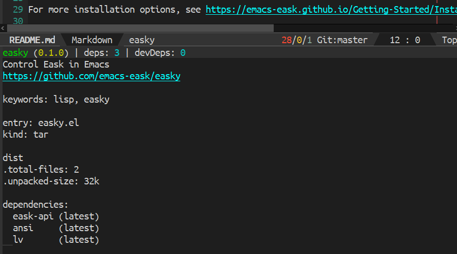
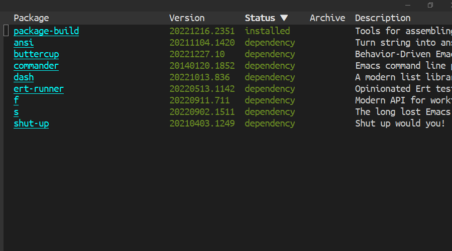

[](https://www.gnu.org/licenses/gpl-3.0)
[](https://jcs-emacs.github.io/jcs-elpa/#/easky)
<a href="#"></a>

# easky
> Control Eask in Emacs

[](https://github.com/emacs-eask/easky/actions/workflows/test.yml)

`Easky` is the interface to control [Eask CLI](https://github.com/emacs-eask/cli),
it's a package manager and sandbox tools to test and manage your elisp packages.

## 🏆 Features

Easky is out of the box and comes along with many features.

| Eask-file Management    | List installed packages                     |
|-------------------------|---------------------------------------------|
|  |  |

| Linting with `checkdoc`         | Testing with `buttercup`          |
|---------------------------------|-----------------------------------|
|  |  |

## 🔰 Getting Started

### 🔍 Step 1. Install [Eask CLI](https://github.com/emacs-eask/cli)

Download binaries from their [release page](https://github.com/emacs-eask/cli/releases)
, and extracted somewhere on your machine. Then add the path `/path/to/eask/`
to environment `PATH`, so you can access it anywhere.

For more installation options, see https://emacs-eask.github.io/Getting-Started/Install-Eask/.

> ⚠ Warning
>
> Make sure the executable `eask` has the permission to execute! Use `chmod`
> command if needed!

### 🔍 Step 2. Install `Easky` (this package)

#### package.el

This package is available from [JCS-ELPA](https://jcs-emacs.github.io/jcs-elpa/).
Install from these repositories then you should be good to go!

Normally, you don't need to add `(require 'easky)` to your configuration since
most `easky` commands are autoloads and can be called without loading the module!

#### use-package

If you use [use-package](https://www.emacswiki.org/emacs/UsePackage), add the
following to your `init.el` file:

```elisp
(use-package easky :ensure t)
```

or with `straight.el`:

```elisp
(use-package easky
  :straight (easky :type git :host github :repo "emacs-eask/easky"))
```

#### Manual installation

Copy all `.el` files in this repository to `~/.emacs.d/lisp` and add the
following:

```elisp
(add-to-list 'load-path "~/.emacs.d/lisp/")
(require 'easky)
```

## 📇 Support Commands

The following are the functions provided by `easky`, you can `M-x` with these
commands:

| Commands                 | Description                                                    |
|--------------------------|----------------------------------------------------------------|
| `easky-init`             | Create Eask-file and initialize it                             |
| `easky-info`             | Print Eask-file information                                    |
| `easky-locate`           | Print Eask installed location                                  |
| `easky-files`            | List all package files.                                        |
| `easky-archives`         | List in used archives                                          |
| `easky-run`              | Execute Eask's script (with completion)                        |
| `easky-package`          | Package (build) your package                                   |
| `eask-install`           | Install packages, see also `M-x easky-package-install`         |
| `eask-uninstall`         | Untnstall packages, see also `M-x easky-package-delete`        |
| `easky-reinstall`        | Reinstall packages, see also `M-x easky-package-reinstall`     |
| `easky-upgrade`          | Upgrade packages., see also `M-x easky-package-update`         |
| `easky-install-deps`     | Install all package dependencies                               |
| `easky-install-deps-dev` | Like `easky-install-deps` but include development dependencies |
| `easky-pkg-file`         | Generate pkg-file and printed it out!                          |
| `easky-recipe`           | Recommend me a recipe format.                                  |
| `easky-help`             | Print Eask help manual                                         |
| `easky-version`          | Print Eask version                                             |
| `easky-upgrade-eask`     | Upgrade Eask CLI                                               |

### 🧹 Cleaning

Commands to keep your project clean:

| Commands                | Description                                          |
|-------------------------|------------------------------------------------------|
| `easky-clean-workspace` | Clean up `.eask` directory                           |
| `easky-clean-dist`      | Delete dist subdirectory                             |
| `easky-clean-elc`       | Remove byte compiled files generated by eask compile |
| `easky-clean-all`       | Do all cleaning tasks.                               |

### 📝 Linting

Commands to help you lint your packages:

| Commands                   | Description         |
|----------------------------|---------------------|
| `easky-lint-checkdoc`      | Run checkdoc        |
| `easky-lint-check-declare` | Run check-declare   |
| `easky-lint-elint`         | Run elint           |
| `easky-lint-elsa`          | Run elsa            |
| `easky-lint-indent`        | Run indent-linet    |
| `easky-lint-keywords`      | Run keywords linter |
| `easky-lint-regexps`       | Run relint          |

> 💡 These extenral tools are automatically installed in your sandbox!

### 🔍 Testing

Commands to help you test your packages:

| Commands                | Description                       |
|-------------------------|-----------------------------------|
| `easky-test-ert`        | Run ert tests                     |
| `easky-test-ert-runner` | Run ert test through `ert-runner` |
| `easky-test-buttercup`  | Run buttercup tests               |

> 💡 These extenral tools are automatically installed in your sandbox!

### 💻 Direct execution

Sometimes you would want to execute some command directly!

| Commands      | Description           |
|---------------|-----------------------|
| `easky-eask`  | Run Eask CLI directly |
| `easky-exec`  | Run `eask exec`       |
| `easky-emacs` | Run `eask emacs`      |

## 🔧 Customization

### 🧪 Variables

List of variables that interact with `easky`'s behaviour.

- `easky-executable` - Executable to eask-cli. (Default: `nil`)
- `easky-display-function` - Function to display Easky's result. (Default: `#'lv-message`)
- `easky-focus-p` - Select window after command execution. (Default: `nil`)
- `easky-move-point-for-output` - Controls whether interpreter output moves point to the end of the output. (Default: `nil`)
- `easky-timeout-seconds` - Timeout seconds for running too long process. (Default: `30`)

## 🔌 Plugins

`easky` comes with a couple of useful additions that can be used along with it.

### 📦 `package` module

WIP

## 🌟 Other packages you may be interested

- [eask-mode](https://github.com/emacs-eask/eask-mode) - major mode for editing Eask files
- [company-eask](https://github.com/emacs-eask/company-eask) - Company backend for Eask-file
- [eldoc-eask](https://github.com/emacs-eask/eldoc-eask) - Eldoc support for Eask-file
- [flycheck-eask](https://github.com/emacs-eask/flycheck-eask) - Eask support in Flycheck
- [flymake-eask](https://github.com/flymake/flymake-eask) - Eask support in Flymake

## Contribute

[](http://makeapullrequest.com)
[](https://github.com/bbatsov/emacs-lisp-style-guide)
[](https://www.paypal.me/jcs090218)
[](https://www.patreon.com/jcs090218)

If you would like to contribute to this project, you may either
clone and make pull requests to this repository. Or you can
clone the project and establish your own branch of this tool.
Any methods are welcome!
